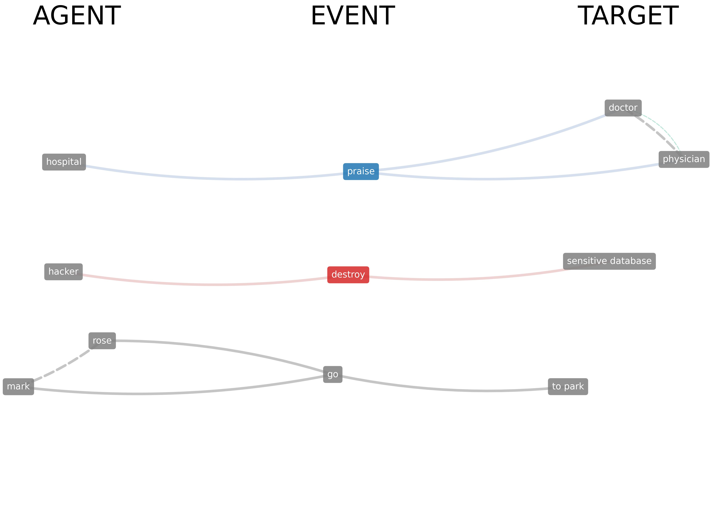
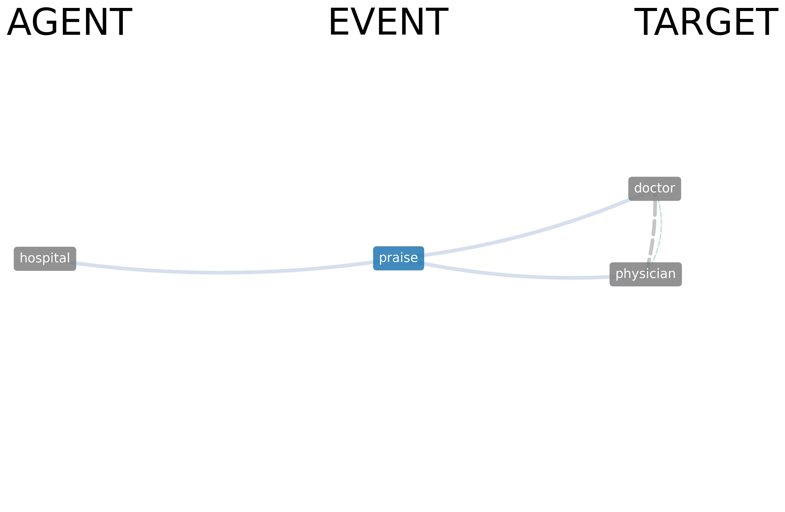
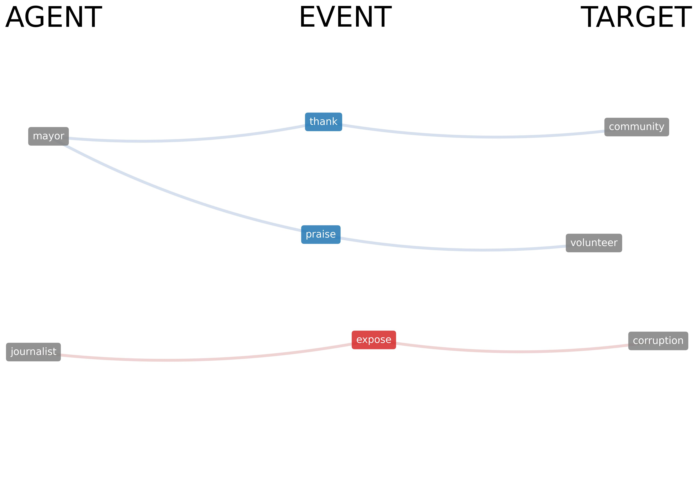

# Target-Event-Agent Networks

<p align="center">
  
</p>

A Python library that implements a novel framework to measure bias through its actors, actions and consequences in English.


## Description
Target-Event-Agent cognitive networks are a novel framework to measure bias through its actors, actions and consequences. These semantic/syntactic multilayer networks are composed of 3 layers:
- **Agent**: Subjects/actors
- **Event**: Verbs/actions
- **Target**: Objects/consequences

Part-of-speech tagging is determined by an AI reading each sentence in a text (spaCy). Inter-layer connections are established with a rule-based approach applied on the syntactic parsing of an AI (spaCy). Intra-layer connections are semantic and established only if two words are synonyms (e.g. father and dad), highlighted in green. Like in textual forma mentis networks (Stella, PeerJ Comp. Sci, 2020), individual concepts are labelled as “positive” (cyan), “negative” (red) and “neutral” (gray) according to Vader Sentiment Analysis. Inter-layer paths indicate “target event agent” - i.e. which actions and which consequences were portrayed by specific agents in texts. Whereas tools such as EmoAtlas can give general results about the overall context of biased perceptions, Target-Event-Agent networks can complement TFMNs by providing a focus on actors, actions and consequences.

This framework only works for the English language.


<p align="center">
  
</p>


## Methodological Revisions

### 1. Passive Voice Handling
The TEA library correctly distinguishes between the semantic agent and the grammatical subject in passive constructions. 
- **Passive WITH Agent** (*"The mayor was impressed by the citizen"*): The agent (*citizen*) is correctly identified as the **Agent**, while the mayor (*mayor*) is mapped to the **Target**.
- **Passive WITHOUT Agent** (*"The window was broken"*): If no agent is present, the patient remains in the **Agent** position as the best available approximation.

| Sentence | Agent | Target |
|:---------|:------------|:--------------|
| *The mayor was impressed by the citizen.* | citizen | mayor |
| *Mark and Rose go to the park.* | Mark, Rose | park |
| *The criminal attacked Mark and Rose.* | criminal | Mark, Rose |

### 2. SVO Extraction Validation
To ensure accuracy, we validated the extraction logic against a **Gold Standard** of 100 exemplary sentences (`data/gold_standard_svo.csv`) covering active/passive voices, imperatives, and complex clauses.
- **Metric-based Evaluation**: We report Precision, Recall, and F1 scores for each component (Agent, Event, Target).
- **Benchmark Driven**: The implementation is continuously tested against manually annotated data to avoid regressions.

---
### Features

- **SVO Extraction**: Extracts subjects (who), verbs(did), and objects(what) from sentences.
- **Coreference Resolution**: Handles pronouns and other references using either `stanza` or `fastcoref`.
- **Valence Analysis**: Determines the sentiment (positive, negative, neutral) of words using Vader.
- **Graph Visualization**: Visualizes SVO relationships using NetworkX and Matplotlib.
- **Hypergraph extraction**: Handles the exporting of the target-event-agent relationships as a pandas dataframe.
- **Semantic enrichment**: Synonyms are included in the SVO extraction and in the visualization.


---
## Installation

Currently, the package can be installed through this Github repository. Note that this requires [Git](https://git-scm.com/) to be installed.

```bash
pip install git+https://github.com/MassimoStel/TEA_Networks.git
```

### Prerequisites

- Python >=3.7,<3.10
- pip package manager

---
## Usage and guides

For detailed documentation and examples, please refer to the folder 'Docs & Guides' or check out the Google Colab demo.


```python
import teanets as tea

text = """The physician and the doctor were praised by the hospital."""

svo = tea.extract_svos_from_text(text)
display(svo)
```

| Node 1 | TEA | Node 2 | TEA2 | Hypergraph | Semantic-Syntactic | svo_id | passive_approx | is_passive |
|:---|:---|:---|:---|:---|---:|---:|---:|---:|
| hospital | Agent | praise | Event | [[('hospital', [])], ['praise'], [('physician'... | 0 | 0 | 0 | 1 |
| praise | Event | physician | Target | [[('hospital', [])], ['praise'], [('physician'... | 0 | 0 | 0 | 1 |
| praise | Event | doctor | Target | [[('hospital', [])], ['praise'], [('physician'... | 0 | 0 | 0 | 1 |
| physician | Target | doctor | Target | [[('hospital', [])], ['praise'], [('physician'... | 0 | 0 | 0 | 1 |
| doctor | Target | physician | Target | N/A | 1 | N/A | 0 | 0 |

> The ``passive_approx`` column flags rows where the *Agent* slot does not contain
> a true semantic agent but rather a patient placed there as best-available
> approximation (passive without by-phrase, e.g. *"the report was reviewed"*).
> Set to ``1`` only for those Agent–Event and Agent–Agent edges; always ``0``
> elsewhere. Older outputs without this column are still fully supported by the
> analytics and plotting helpers (treated as ``0``).


```python
tea.plot_svo_graph(svo)
```
<p align="center">
  
</p>

### Multi-sentence example

A richer example showing multiple agents and verbs across sentences:

```python
text = """The journalist exposed the corruption. The mayor praised the volunteers and thanked the community."""

svo = tea.extract_svos_from_text(text)
display(svo)
```

| Node 1 | TEA | Node 2 | TEA2 | Hypergraph | Semantic-Syntactic | svo_id | passive_approx | is_passive |
|:---|:---|:---|:---|:---|---:|---:|---:|---:|
| journalist | Agent | expose | Event | [[('journalist', [])], ['expose'], [('corrupti... | 0 | 0 | 0 | 0 |
| expose | Event | corruption | Target | [[('journalist', [])], ['expose'], [('corrupti... | 0 | 0 | 0 | 0 |
| mayor | Agent | praise | Event | [[('mayor', [])], ['praise'], [('volunteer', [... | 0 | 1 | 0 | 0 |
| praise | Event | volunteer | Target | [[('mayor', [])], ['praise'], [('volunteer', [... | 0 | 1 | 0 | 0 |
| mayor | Agent | thank | Event | [[('mayor', [])], ['thank'], [('community', []... | 0 | 2 | 0 | 0 |
| thank | Event | community | Target | [[('mayor', [])], ['thank'], [('community', []... | 0 | 2 | 0 | 0 |

```python
tea.plot_svo_graph(svo)
```
<p align="center">
  
</p>

### Generating TEA Figures

A step-by-step tutorial for generating TEA network figures: [Generating TEA Figures](https://github.com/MassimoStel/TEA_Networks/blob/main/Docs%20%26%20Guides/Generating_TEA_Figures.ipynb)

### Starting Guide

You can access the Starting Guide here: [Starting Guide](https://github.com/MassimoStel/TEA_Networks/blob/main/Docs%20%26%20Guides/Starting%20Guide.ipynb)

The starting guide features a more complete description of the package and a usage guide.


### Google Colab Demo

You can access the Google Colab demo here: [Target-Event-Agent Demo](https://colab.research.google.com/drive/1fs73YQkPu55C_Cwt2lYhuvfc0aBXjnQo?usp=sharing).


---
## Citation

Franchini, S., Carrillo, A., De Duro, E. S., Improta, R., Ardebili, A. A., & Stella, M. (2026). TEA Nets combine AI and cognitive network science to model actors, actions, and consequences in text [Preprint]. arXiv. https://github.com/MassimoStel/TEA_Networks

## References:
- *Stella, M. (2020). Text-mining forma mentis networks reconstruct public perception of the STEM gender gap in social media. PeerJ Computer Science, 6, e295.*
- *Hutto, C., & Gilbert, E. (2014, May). Vader: A parsimonious rule-based model for sentiment analysis of social media text. In Proceedings of the international AAAI conference on web and social media (Vol. 8, No. 1, pp. 216-225).*

## Acknowledgments

This work is part of the PENSO project, supported by the Ministero dell'Università e della Ricerca (MUR) according to Decreto N. 23178 of 10 dicembre 2024 — Bando FIS 2. The authors acknowledge support from CALCOLO, funded by Fondazione VRT, for support with the computational infrastructure simulating LLMs.

## License

This project is licensed under the BSD 3-Clause License.
